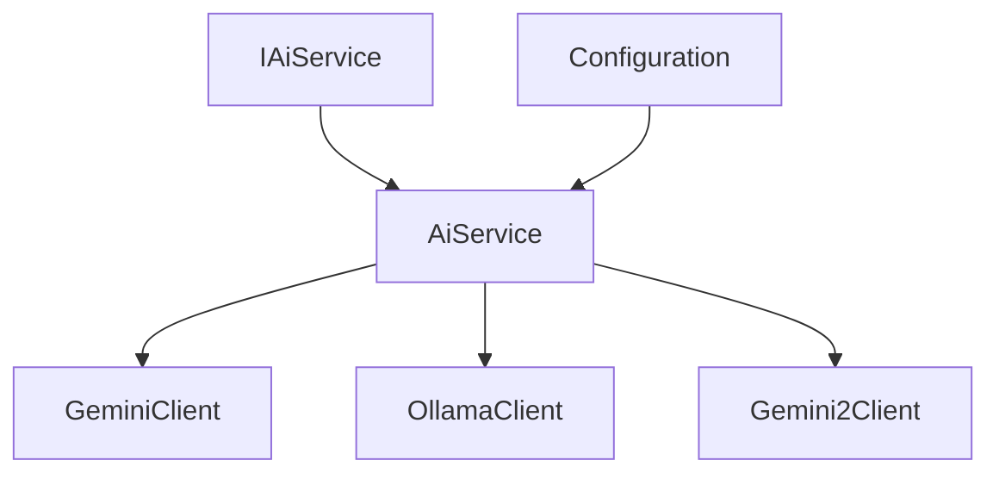
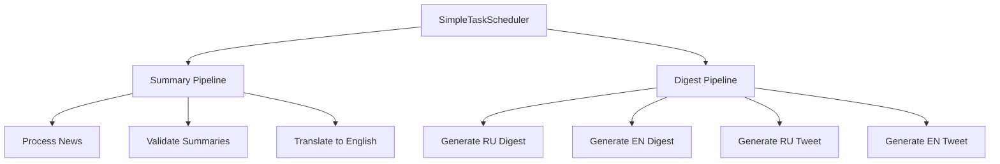
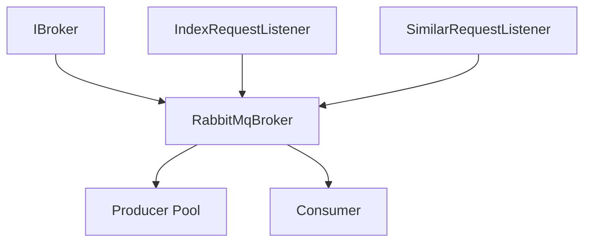
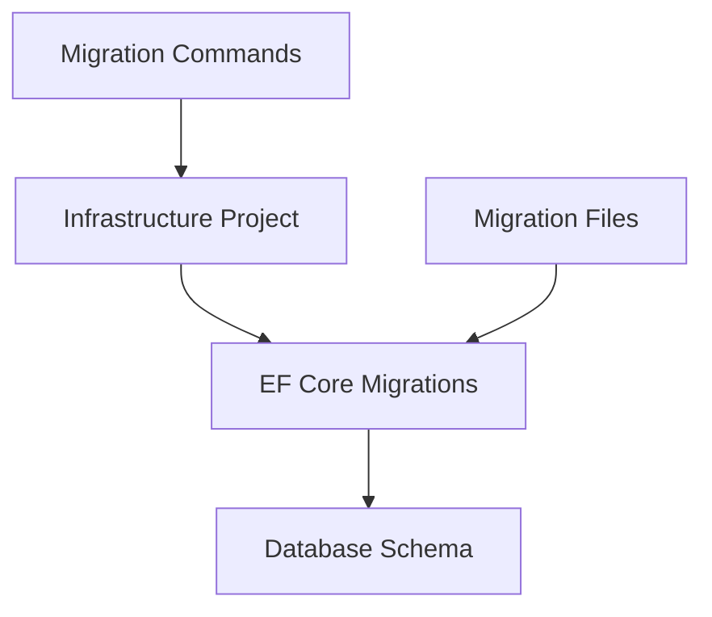

# Core Components

This document describes the core components of the Fuddy-Duddy system, their interactions, and implementation details.

## AI Service Architecture

The AI service is designed to be flexible and support multiple AI providers (Gemini, Ollama) with different model types for various tasks.

### Overview



### Key Components

1. **IAiService Interface**
```csharp
public interface IAiService
{
    Task<T?> GenerateStructuredResponseAsync<T>(
        string systemPrompt,
        string userInput,
        T sample,
        CancellationToken cancellationToken = default) where T : IAiModelResponse;
}
```

2. **Model Selection**
- Models are configured in `appsettings.json`
- Each response type is mapped to a specific model and type (Light, Pro, SuperLight)
- The service automatically selects the appropriate client based on the response type

### Implementation Details

1. **Client Organization**
```csharp
private readonly Dictionary<ModelType, IAiClient> _geminiClients;
private readonly Dictionary<ModelType, IAiClient> _gemini2Clients;
private readonly Dictionary<ModelType, IAiClient> _ollamaClients;
```

2. **Model Selection Logic**
```csharp
private IAiClient GetModelClient<T>() where T : IAiModelResponse
{
    // Get mapping from configuration
    var mapping = _aiModelsOptions.Value.ResponseMappings[typeof(T).Name];
    
    // Select appropriate client dictionary
    var modelDictionary = mapping.Model switch
    {
        "Gemini" => _geminiClients,
        "Gemini2" => _gemini2Clients,
        "Ollama" => _ollamaClients,
        _ => throw new ArgumentException($"Invalid model type")
    };

    return modelDictionary[mapping.ModelType];
}
```

## Task Scheduler

The `SimpleTaskScheduler` is responsible for running periodic tasks such as news crawling, summary generation, and digest creation.

### Overview



### Key Features

1. **Configurable Intervals**
- Summary pipeline interval
- Digest pipeline interval
- Individual task toggles

2. **Pipeline Locking**
- Uses `SemaphoreSlim` to prevent concurrent executions
- Separate locks for summary and digest pipelines

3. **Task Configuration**
```json
{
  "TaskScheduler": {
    "Enabled": true,
    "SummaryPipelineInterval": 300000,
    "DigestPipelineInterval": 3600000,
    "SummaryTask": true,
    "ValidationTask": true,
    "TranslationTask": true,
    "DigestTask": true
  }
}
```

## Message Broker System

The message broker system provides asynchronous communication between components using RabbitMQ.

### Overview



### Key Components

1. **IBroker Interface**
```csharp
public interface IBroker
{
    Task ConsumeAsync<T>(string queueName, Func<T, Task> handler, CancellationToken cancellationToken = default);
    Task PushAsync<T>(string queueName, T message, CancellationToken cancellationToken = default);
}
```

2. **RabbitMQ Implementation**
- Uses quorum queues for reliability
- Implements retry logic for publishing
- Connection and channel pooling
- Proper error handling and logging

### Message Listeners

1. **IndexRequestListener**
- Handles vector search indexing requests
- Supports add/delete operations
- Configurable through search settings

2. **SimilarRequestListener**
- Processes requests to find similar articles
- Uses vector similarity search
- Configurable through similarity settings

### Example Usage

```csharp
// Publishing a message
await _broker.PushAsync(QueueNameConstants.Index, new IndexRequest 
{ 
    NewsSummaryId = summaryId,
    Type = IndexRequestType.Add 
});

// Consuming messages
await _broker.ConsumeAsync<IndexRequest>(
    QueueNameConstants.Index,
    async (message) => await HandleIndexRequestAsync(message),
    cancellationToken);
```

## Database Migrations

The project uses Entity Framework Core migrations to manage database schema changes. Migrations are stored in the `src/Core/FuddyDuddy.Core.Infrastructure/Data/Migrations` directory.

### Overview



### Key Operations

1. **Creating a New Migration**
```bash
# From solution root
dotnet ef migrations add MigrationName --project src/Core/FuddyDuddy.Core.Infrastructure -o Data/Migrations

# Or from the Infrastructure project directory
dotnet ef migrations add MigrationName -o Data/Migrations
```

2. **Applying Migrations**
```bash
# From solution root
dotnet ef database update --project src/Core/FuddyDuddy.Core.Infrastructure

# Or from the Infrastructure project directory
dotnet ef database update
```

3. **Removing Last Migration**
```bash
# From solution root
dotnet ef migrations remove --project src/Core/FuddyDuddy.Core.Infrastructure

# Or from the Infrastructure project directory
dotnet ef migrations remove
```

4. **Generating SQL Scripts**
```bash
# From solution root
dotnet ef migrations script --project src/Core/FuddyDuddy.Core.Infrastructure

# Or from the Infrastructure project directory
dotnet ef migrations script
```

### Best Practices

1. **Migration Naming**
- Use descriptive names (e.g., `AddUserEmailIndex`, `UpdateArticleSchema`)
- Include the purpose of the change in the name
- Use PascalCase naming convention

2. **Version Control**
- Always commit migration files to source control
- Include both the migration file and the snapshot
- Document breaking changes in migration

3. **Deployment**
- Test migrations on a copy of production data
- Include migrations in deployment pipeline
- Have a rollback plan for each migration

4. **Development Workflow**
- Create migrations in feature branches
- Review migration code before merging
- Test migrations in development environment

## Best Practices

1. **Error Handling**
- All operations should be properly logged
- Failed operations should be retried with appropriate backoff
- Critical errors should be reported to monitoring systems

2. **Configuration**
- Use strongly-typed configuration objects
- Provide reasonable defaults
- Document all configuration options

3. **Resource Management**
- Properly dispose of connections and channels
- Use connection pooling where appropriate
- Implement rate limiting for external services

4. **Monitoring**
- Log important operations
- Track performance metrics
- Monitor queue depths and processing times

## See Also
- [Deployment Guide](deployment-guide.md)
- [API Documentation](api-documentation.md)
- [Development Guidelines](development-guidelines.md) 